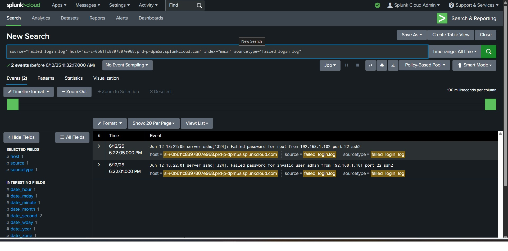
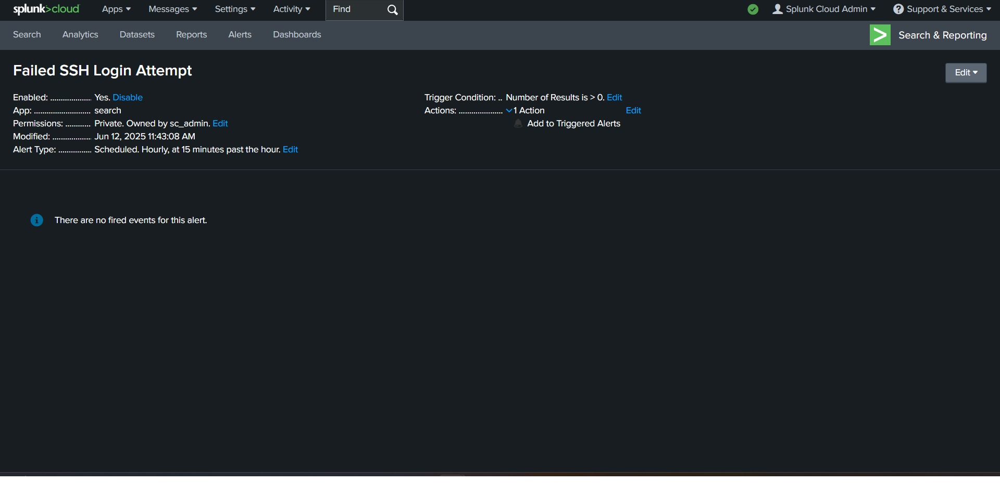
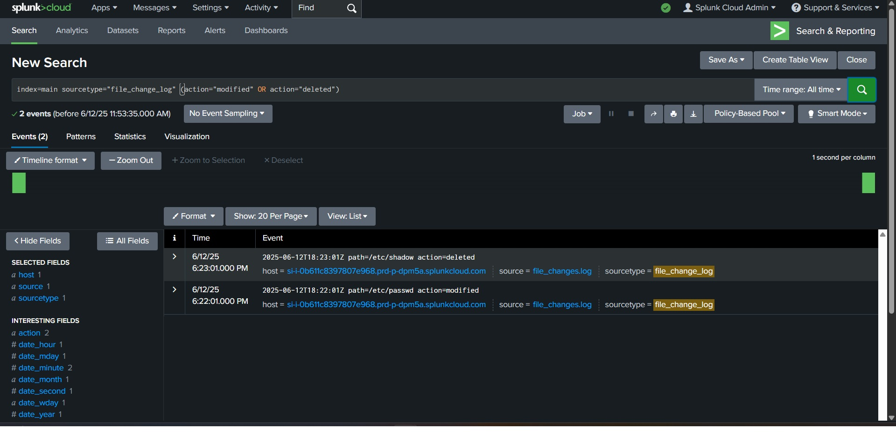
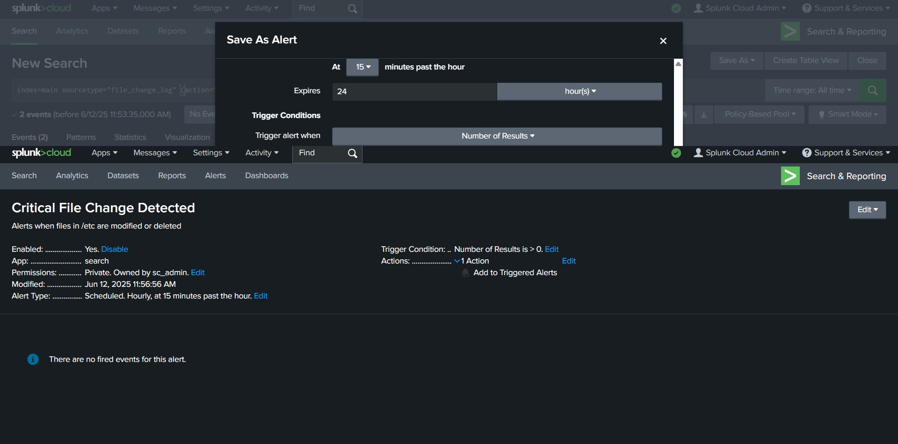
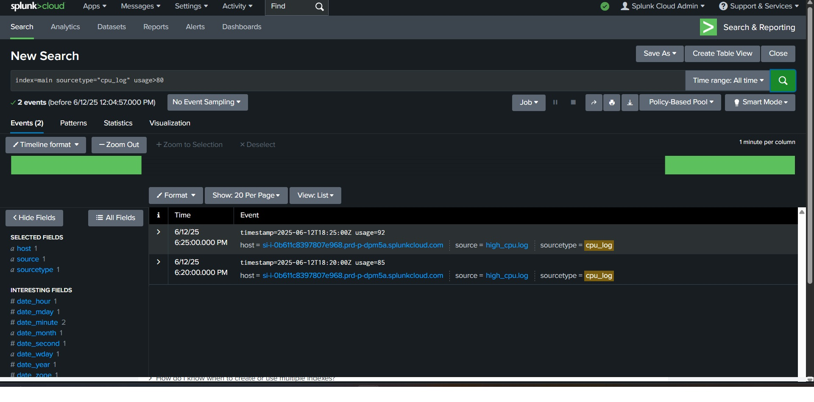
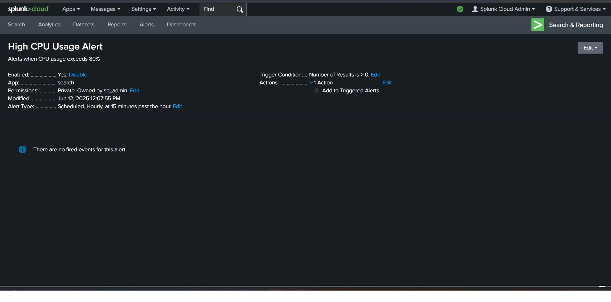
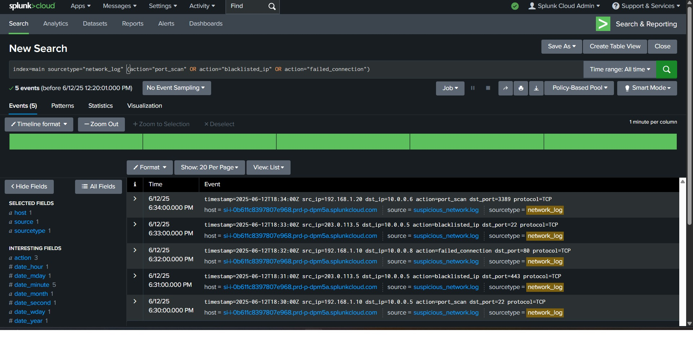
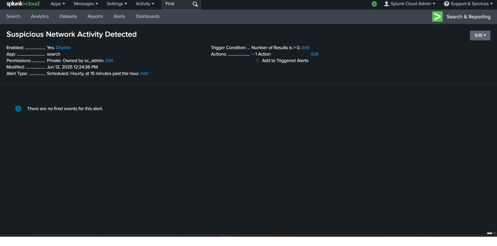
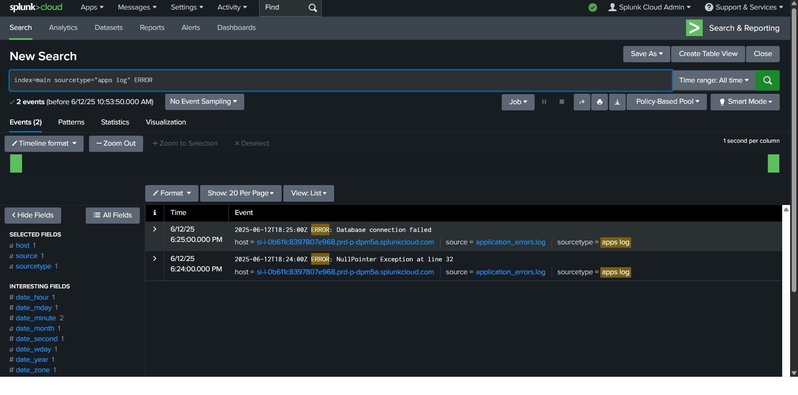
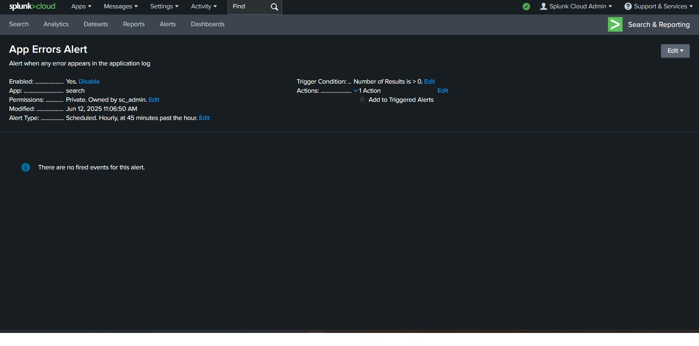

# Splunk Threat Intelligence & Incident Response Monitoring

## 📌 Overview
This project demonstrates threat intelligence monitoring and incident response use cases using Splunk SIEM. The project focuses on detecting suspicious activities, monitoring system behavior and analyzing security-related events through Splunk queries and alerts.

This project simulates real-world SOC (Security Operations Center) monitoring and security event analysis workflows.

---

## 🎯 Objectives
- Monitor failed login attempts
- Detect suspicious network activity
- Track file modifications
- Monitor system performance anomalies
- Analyze application errors using Splunk

---

## 🛠️ Tools Used
- Splunk SIEM
- Windows Event Logs
- Log Monitoring
- Security Event Analysis

---

## 🔧 Work Performed
- Created Splunk queries for failed login detection
- Monitored file integrity and unauthorized modifications
- Configured alerts for high CPU usage
- Analyzed suspicious network activity and failed connections
- Investigated application error logs

---

## 📸 Screenshots

### 🔐 Failed Login Attempts
This demonstrates monitoring and detection of repeated failed login attempts using Splunk queries.

Detection of failed SSH login attempts using Splunk search queries and log analysis.

Configured Splunk alert to trigger notifications for suspicious failed login activity.

---

### 📂 File Change Monitoring
This demonstrates monitoring of file modification events for detecting unauthorized changes and integrity issues.

Monitoring critical system file modifications and deletions in real time using Splunk.

Automated alert configured to detect unauthorized changes in sensitive system files.

---

### ⚙️ High CPU Usage Monitoring
This demonstrates monitoring of system performance anomalies and high resource utilization events.

Detection of abnormal CPU utilization events exceeding predefined security thresholds.

Configured Splunk alert to identify and notify high CPU usage incidents.

---

### 🌐 Suspicious Network Activity
This demonstrates detection of suspicious network behavior such as failed connections and abnormal traffic patterns.

Detection of suspicious network behavior including port scans, blacklisted IPs, and failed connections.

Real-time Splunk alert configured for suspicious network activity monitoring and threat detection.

---

### ❌ Application Error Monitoring
This demonstrates monitoring and analysis of application-related error events within the system logs.

Monitoring application logs to identify critical runtime errors and system failures.

Configured alert system to detect and notify application error events automatically.

---

## 📊 Key Findings
- Failed login monitoring helps detect brute-force attempts
- File integrity monitoring helps identify unauthorized modifications
- High CPU usage alerts help detect system overload or malicious activity
- Suspicious network activity can indicate reconnaissance or attack attempts
- Centralized log monitoring improves incident detection and response

---

## 🧠 Learning Outcomes
- Learned SIEM-based monitoring and alerting techniques
- Gained hands-on experience with Splunk query analysis
- Understood incident response and threat monitoring workflows
- Learned how security teams analyze and investigate logs
- Improved understanding of SOC operations and event correlation

---

## 🛡️ Security Importance
- Continuous monitoring improves threat detection capabilities
- Log analysis helps identify suspicious behavior early
- Security event correlation supports incident response workflows
- SIEM tools help centralize and analyze security data efficiently

---

## 📄 Detailed Report
[View Full Report](splunk-threat-intelligence-report.pdf)

---

## 🔚 Conclusion
This project demonstrates foundational SIEM monitoring and threat analysis skills using Splunk. It highlights the importance of centralized logging, event monitoring, and proactive threat detection in modern security operations.

---

## 👨‍💻 Author
Harsh – Cybersecurity Enthusiast
